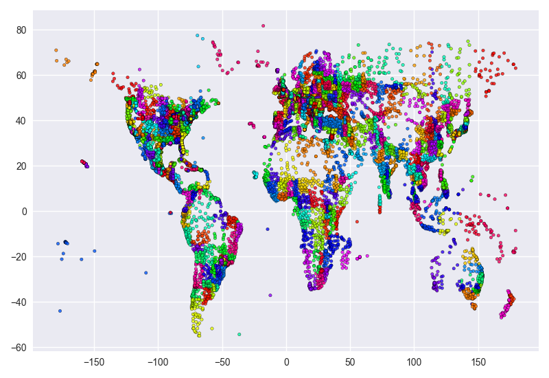
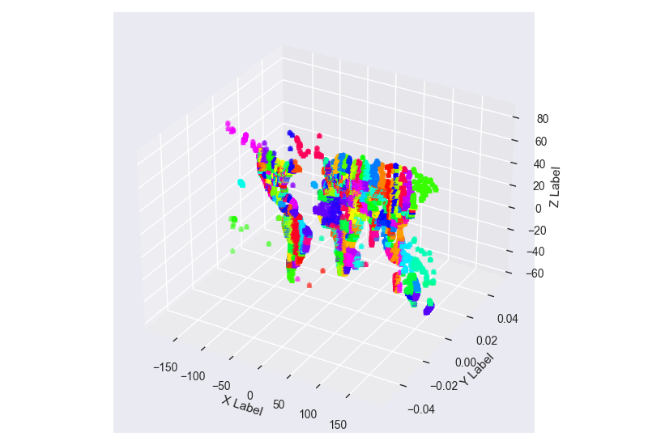
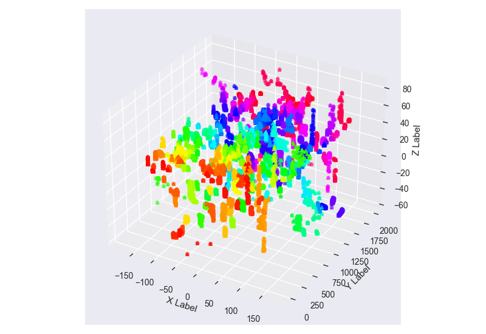

### *Data-Base Technology 2020, 6th Semester of Computer Science Dept. @ Aristotle University of Thessaloniki*
***Developers: [GregB712](https://github.com/GregB712), [SotirisFtiakas](https://github.com/SotirisFtiakas).***

## Spatial Data Indexing - R*-Tree 

### Purpose

The purpose of this project was the development of an R*-Tree, a tree data struture that can store multi-dimensional data in a more efficient way than the conventional R-Tree. 

### What is an R-Tree?

R-trees are **tree data structures used for spatial access methods**, i.e., for indexing multi-dimensional information such as geographical coordinates, rectangles or polygons. 

The key idea of the data structure is to group nearby objects and represent them with their minimum bounding rectangle in the next higher level of the tree. Since all objects lie within this bounding rectangle, a query that does not intersect the bounding rectangle also cannot intersect any of the contained objects.

The **key difficulty** of R-tree is to build an efficient tree that on one hand is **balanced** (so the leaf nodes are at the same height) on the other hand **the rectangles do not cover too much empty space and do not overlap too much.**

### Difference between R*-Tree and R-Tree?

Minimization of both **coverage** and **overlap** is crucial to the performance of R-trees. **Overlap** means that, on data query or insertion, more than one branch of the tree needs to be expanded. A minimized **coverage** improves pruning performance, allowing exclusion of whole pages from search more often, in particular for negative range queries. The R*-tree **attempts to reduce both**, using a combination of a revised node split algorithm and the concept of forced reinsertion at node overflow.

### Performance of R*-Tree

- **Improved split heuristic** produces pages that are more rectangular and thus better for many applications.
- **Reinsertion method** optimizes the existing tree, but increases complexity. ***( NOT IMPLEMENTED )***
- Efficiently **supports point and spatial data** at the same time.

#### Source: Wikipedia [R-Tree](https://en.wikipedia.org/wiki/R-tree) and [R*-Tree](https://en.wikipedia.org/wiki/R*_tree).

### Visualization Examples

#### 2D
Representation of the world based on the leaf nodes stored from the [simplemaps](https://simplemaps.com/data/world-cities) dataset into the R*-Tree (~ 26.000 entries )

#### 3D
Representation of the world using the leaf-ID as the third axis attribute.
2D             |  3D
:-------------------------:|:-------------------------:
 |  

